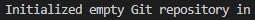

# **Инструкция по работе с Git.** #

**Git** - это система контроля и управления версиями.

*Для чего?*

* чтобы отследить изменения, произошедшие с проектом, со временем;
* для единовременной работы нескольких специалистов над одним проектом;

## **Начало** ##
___

Для того, чтобы начать работать с Git, необходимо:

1. **Установить** **_Git_** с официального сайта [**git download**](https://git-scm.com/downloads/ "Ссылка на официальный сайт");
    * на оф. сайте также есть [__инструкция__](https://git-scm.com/book/ru/v2/ "Ссылка на официальный сайт") об установке __Git__ на различные системы - Linux, Mac, Windows. 

2. После установки Git на компьютер, необходимо **выполнить** следующие команды настроек:

    > git config --global user.name "My Name"

    > git config --global user.email myEmail@example.com,

Для удобства и легкости зрительного восприятия, некоторые группы команд в Git можно выделить цветом, для этого нужно прописать в консоли:
> git config --global color.ui true

> git config --global color.status auto

> git config --global color.branch auto
    
__!__ Для того, чтобы посмотреть __все настройки__ системы, используйте команду:  

> git config --list

**Все команды git выполняются в           терминале (командной строке).**

Для этого необходимо нажать **"Терминал"** -> **"Создать терминал"** или ПКМ на область рабочего каталога, открытого справа в проводнике и далее **"Открыть во встроенном терминале"**.

___

## **Первые операции** ##
___

### **1. Создание нового репозитория.** ###

Чтобы создать новый репозиторий, необходимо открыть терминал, зайти в папку вашего проекта и выполнить команду init.

- создайте папку, в которой будет храниться и отслеживаться ваш проект;
- откройте терминал (см. п.2 блока "**Начало**") и в открывшемся окне командной строки введите:
    > git init

Это включит приложение в этой конкретной папке и создаст скрытую директорию .git, где будет храниться история репозитория и настройки.

**У вас появится следующая надпись:**

### **2. Добавление новых файлов в репозиторий.** ###

+ создайте в каталоге репозитория файл: name.md (Name.md - название вашего файла с расширением) и напишите любой текст в первой строке;

**! Теперь для того, чтобы Git начал отслеживать файл, необходимо ввести в терминале следующую команду _(перед этим не забудьте сохраниться ctrl + S или включить автосохранение)_:**

> git add name.md

Если в директории больше одного файла и необходимо добавить все, то можно воспользоваться командной:

> git add -A

или

> git add .

### **3. Фиксация изменений.** ###

Теперь, когда ваш файл находится под наблюдением **git**, необходимо сохранить изменения в репозитории и сделать первый коммит.

Для этого введите следующую команду:

> git commit -m "Ваш комментарий"

Если вдруг вам нужно переделать commit message и внести туда изменения, можно написать следующую команду:

> git commit --amend -m 'Новый комментарий'

В данном случае сообщение последнего коммита перезапишется. 

___

## **Базовые команды** ##
---

**!** Команда, которая показывает информацию о текущем состоянии репозитория: актуальна ли информация на нём, нет ли чего-то нового, что поменялось, и так далее. 

- проверить текущий статус репозитария:

    > git status

**!** Для просмотра всех выполненных фиксаций можно воспользоваться историей коммитов. Она содержит сведения о каждом отдельном коммите, с указанием его хэша, автора, списка изменений и даты, когда они были сделаны.

- просмотреть историю проекта:

    > git log

**!** Отследить интересующие вас операции в списке изменений, можно по хэшу коммита, при помощи команды:

> git show hash_commit

- переключиться на интересующую вас версию проекта:

    > git checkout первые_несколько_символов_номера_коммита

___

## **Работа с ветками** ##
---

Во время разработки новой функциональности считается хорошей практикой работать с копией оригинального проекта, которую называют веткой. Ветви имеют свою собственную историю и изолированные друг от друга изменения до тех пор, пока вы не решаете слить изменения вместе. 
    Это происходит по набору причин:

+ уже рабочая, стабильная версия кода сохраняется;
+ различные новые функции могут разрабатываться параллельно разными программистами;
+ разработчики могут работать с собственными ветками без риска, что кодовая база поменяется из-за чужих изменений;
+ в случае сомнений, различные реализации одной и той же идеи могут быть разработаны в разных ветках и затем сравниваться.

### **1. Создание новой ветки.** ###

Основная ветка в каждом репозитории называется master или main. Чтобы создать еще одну ветку, используйте команду:

> git branch имя_новой_ветки

### **2. Переключение между ветками.** ###

+ чтобы увидеть список существующих веток, введите команду:

    > git branch

__!__ Ветка, на которой вы находитесь будет выделена **зеленым** цветом и __звездочкой*__. 

+ чтобы перейти на другую ветку, введите команду:

    > git checkout имя_ветки

### **3. Слияние.** ###

Чтобы слить нужную ветку с основной веткой master (main), необходимо:

* __*переключиться на ветку master (main);*__

* ввести команду:

    > git merge имя_сливаемой_ветки

### **4. Удаление ветки.** ### 

__!__ Прежде чем удалить определенную ветку, необходимо переключиться с нее на другую ветку.

- После этого введите команду:

> git branch -d имя_удаляемой_ветки

___

## **Работа с удаленным репозиторием** ##

___

Необходимо зарегистрироваться на
[**GitHub**](https://github.com/ "Ссылка на официальный сайт") .

---

**! Подробнее с работой _Git_ можно ознакомиться на официальном сайте:**
-

