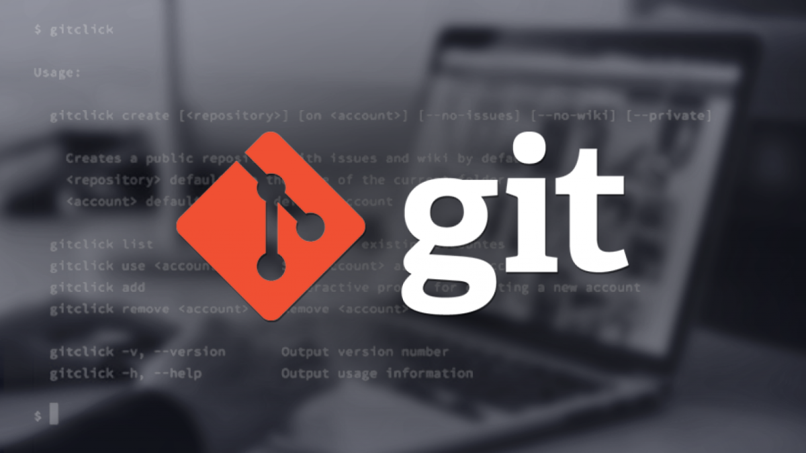

# **Инструкция по командам Git**

## Команды работы с файлами ##

* **git init** - *инициализация локального репозитория*
* **git status** - _получить информацию о текущем состоянии_
* **git add имя_файла** - *добавить файл в индекс*
* **git commit -m "message"** - *создать коммит*
* **git log** - *вывод истории коммитов с их хеш-кодами*
* **git checkout хеш-код** - *переход от одного коммита к другому*
* **git checkout master** - *вернуться к актуальному состоянию (последнему коммиту)*
* **git diff** - *показать разницу между текущим и закоммиченным файлами*

---
## Команды работы с ветками ##

* **git branch** - *просмотр списка веток репозитория*
* **git branch имя_ветки** - *создать новую ветку*
* **git branch -d имя_ветки** - *удалить ветку*
* **git checkout имя_ветки** - *переход к другой ветке*
* **git merge имя_ветки** - *делает слияние ветки <имя_ветки> с текущей веткой*
---

## Работа с удаленным репозиторием ##

---
## Ссылки на материалы по работе с Git ##

[Git для новичков (часть 1)](https://habr.com/ru/post/541258/ "Статья на Хабре")    
[Git для новичков (часть 2)](https://habr.com/ru/post/542616/ "Статья на Хабре")    
[Настройка репозитория](https://www.atlassian.com/ru/git/tutorials/setting-up-a-repository)    
[Сохранение изменений](https://www.atlassian.com/ru/git/tutorials/saving-changes)    
[Проверка репозитория](https://www.atlassian.com/ru/git/tutorials/inspecting-a-repository)    
[Отмена изменений](https://www.atlassian.com/ru/git/tutorials/undoing-changes)    
<u>[Дополнительные фукции для работы с Git](https://www.atlassian.com/ru/git/tutorials/rewriting-history)</u>    

---
Полная [инструкция](https://learn.microsoft.com/ru-ru/contribute/markdown-reference) по MarkDown