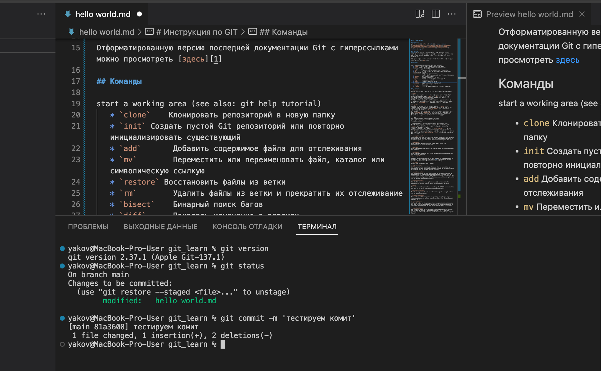

[1]: https://git.github.io/htmldocs/git.html

# Инструкция по GIT

## Синтаксис
git [--version] [--help] [-C <path>] [-c <name>=<value>]
[--exec-path[=<path>]] [--html-path] [--man-path] [--info-path]
[-p|--paginate|--no-pager] [--no-replace-objects] [--bare]
[--git-dir=<path>] [--work-tree=<path>] [--namespace=<name>]
<command> [<args>]

## Описание
**Git** — это быстрая, масштабируемая, распределенная система контроля версий с необычайно богатым набором команд, обеспечивающим как высокоуровневые операции, так и полный доступ к внутренним компонентам.

Отформатированную версию последней документации Git с гиперссылками можно просмотреть [здесь][1] 

## Команды

start a working area (see also: git help tutorial)
   * `clone`    Клонировать удаленный репозиторий в новую папку, указываем ссылку
   * `fetch`  Скачать изменения с удаленного репозитория без слияния веток.
   * `pull` Скачать изменения с удаленного репозитория со слиянием веток
   * `push` Выгрузка локального репозитория в удаленный, необходимо указать адрес репозитория и исеть туда доступ
   * `init` Создать пустой Git репозиторий или повторно инициализировать существующий
   * `add`       Добавить содержимое файла для отслеживания
   * `mv`        Переместить или переименовать файл, каталог или символическую ссылкую
   * `restore` Восстановить файлы из ветки
   * `rm`        Удалить файлы из ветки и прекратить их отслеживание
   * `bisect`    Бинарный поиск багов
   * `diff`      Показать изменения в версиях
   * `grep`      Вывести сроки удовлетворяющие шаблону
   * `log`       Показать лог комитов
   * `show`      Показать объекты в ветке
   * `status`    Показать статус актальной ветки
   * `commit`    Запись изменений в репозиторий
   * `branch`    показать список веток, если с параметрами то управление ветками.
   * `merge`     слияние отдельных направлений 
   разработки, созданных с помощью команды git branch, в единую ветку.
   * `rebase`    Перебазирование — это один из двух инструментов Git для внедрения изменений из одной ветки в другую. Такие же возможности предоставляет команда git merge (слияние). Операция слияния фиксирует изменения, всегда двигаясь вперед по истории проекта, в то время как перебазирование позволяет эффективно ее переписывать. Подробные сведения об операциях слияния и перебазирования см. в руководстве Сравнение слияния и перебазирования. названием

## Параметры
`--version`
Выводит версию пакета Git, из которой была создана программа git.

`--help`
Распечатывает краткий обзор и список наиболее часто используемых команд. Если задана опция `--all` или `-a`, то выводятся все доступные команды. Если команда Git названа, эта опция откроет справочную страницу для этой команды.
Доступны и другие параметры для управления отображением справочной страницы. См. git-help(1) для получения дополнительной информации, потому что `git --help` ... преобразуется внутри в git help ....

`-C <path>`
Запускайте так, как если бы git был запущен в `<path>` вместо текущего рабочего каталога. Когда задано несколько параметров -C, каждый последующий неабсолютный `-C <path>` интерпретируется относительно предыдущего `-C <path>`.
Этот параметр влияет на параметры, которые ожидают имя пути, такое как `--git-dir` и `--work-tree`, поскольку их интерпретации имен путей будут сделаны относительно рабочего каталога, вызванного параметром -C. Например, следующие вызовы эквивалентны:

``` bash
git --git-dir=a.git --work-tree=b -C c status
git --git-dir=c/a.git --work-tree=c/b status
-c <name>=<value>
```
Передайте параметр конфигурации команде. Заданное значение переопределит значения из файлов конфигурации. Ожидается, что `<name>` будет иметь тот же формат, что указан в git config (подключи разделены точками).
Обратите внимание, что пропуск = в `git -c foo.bar ...` разрешен и устанавливает для foo.bar логическое значение true (точно так же, как [foo]bar в файле конфигурации). Включение равенства, но с пустым значением (например, `git -c foo.bar= ...`) устанавливает foo.bar в пустую строку.

`--exec-path[=<path>]`
Path to wherever your core Git programs are installed. This can also be controlled by setting the GIT_EXEC_PATH environment variable. If no path is given, git will print the current setting and then exit.

`--html-path`
Print the path, without trailing slash, where Git's HTML documentation is installed and exit.

`--man-path`
Print the manpath (see man(1)) for the man pages for this version of Git and exit.

`--info-path`
Print the path where the Info files documenting this version of Git are installed and exit.
`-p, --paginate`

Pipe all output into less (or if set, $PAGER) if standard output is a terminal. This overrides the pager.<cmd> configuration options (see the "Configuration Mechanism" section below).
`--no-pager`
Do not pipe Git output into a pager.

`--git-dir=<path>`
Set the path to the repository. This can also be controlled by setting the GIT_DIR environment variable. It can be an absolute path or relative path to current working directory.

`--work-tree=<path>`
Set the path to the working tree. It can be an absolute path or a path relative to the current working directory. This can also be controlled by setting the GIT_WORK_TREE environment variable and the core.worktree configuration variable (see core.worktree in git-config(1) for a more detailed discussion).

`--namespace=<path>`
Set the Git namespace. See gitnamespaces(7) for more details. Equivalent to setting the GIT_NAMESPACE environment variable.

`--bare`
Treat the repository as a bare repository. If GIT_DIR environment is not set, it is set to the current working directory.

`--no-replace-objects`
Do not use replacement refs to replace Git objects. See git-replace(1) for more information.

`--literal-pathspecs`
Treat pathspecs literally (i.e. no globbing, no pathspec magic). This is equivalent to setting the GIT_LITERAL_PATHSPECS environment variable to 1.

`--glob-pathspecs`
Add "glob" magic to all pathspec. This is equivalent to setting the GIT_GLOB_PATHSPECS environment variable to 1. Disabling globbing on individual pathspecs can be done using pathspec magic ":(literal)"

`--noglob-pathspecs`
Add "literal" magic to all pathspec. This is equivalent to setting the GIT_NOGLOB_PATHSPECS environment variable to 1. Enabling globbing on individual pathspecs can be done using pathspec magic ":(glob)"

`--icase-pathspecs`
Add "icase" magic to all pathspec. This is equivalent to setting the GIT_ICASE_PATHSPECS environment variable to 1.


## Пример работы (скриншот)
[](./screen1.jpg)