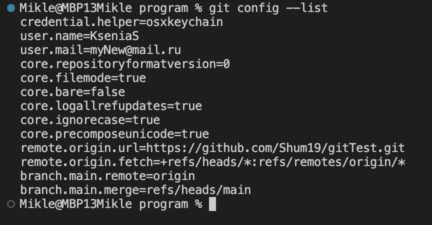
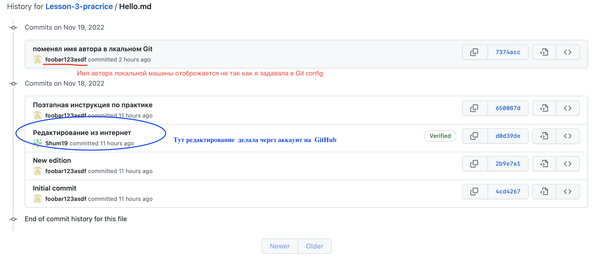

# Добрый день! Фаил создан для закрепления навыков работы с Git
## __Прошу рассмотреть мой вопрос по работе с удалленым репозиторием!__

_Вопрос: почему при закачивании репозиторий на GitHub не прописывается имя автора указанного в Git config а по какой-то причине пишется вообще не понятное имя?_
  _Ниже я закрепила скриншоты своих пробных репозиторй которые я закачала на свой аккаунт и как отобраажается _$ git config --list_ на локальной машине:

__Ответ прошу направить в комментариях к домашнему заданию__

Спасибо!
